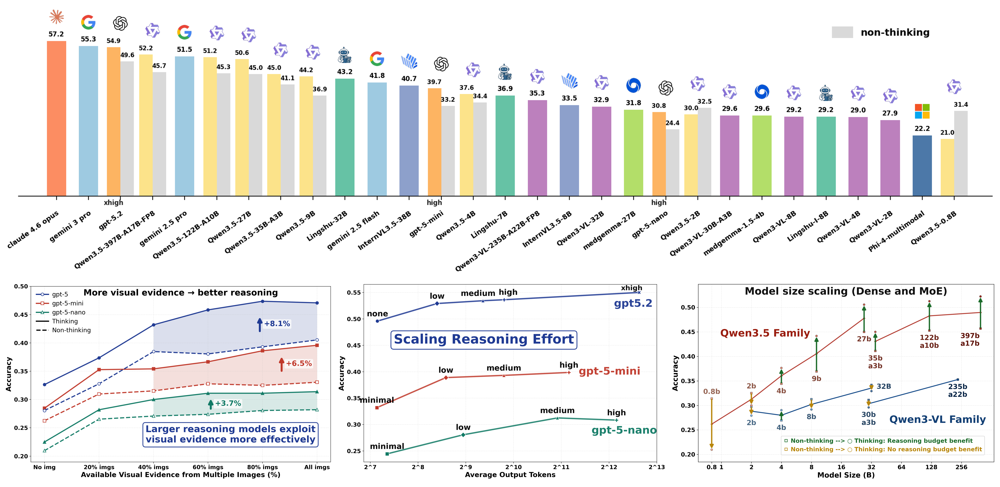
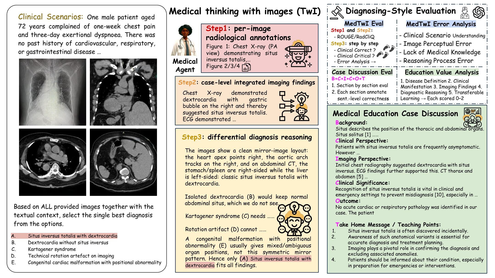
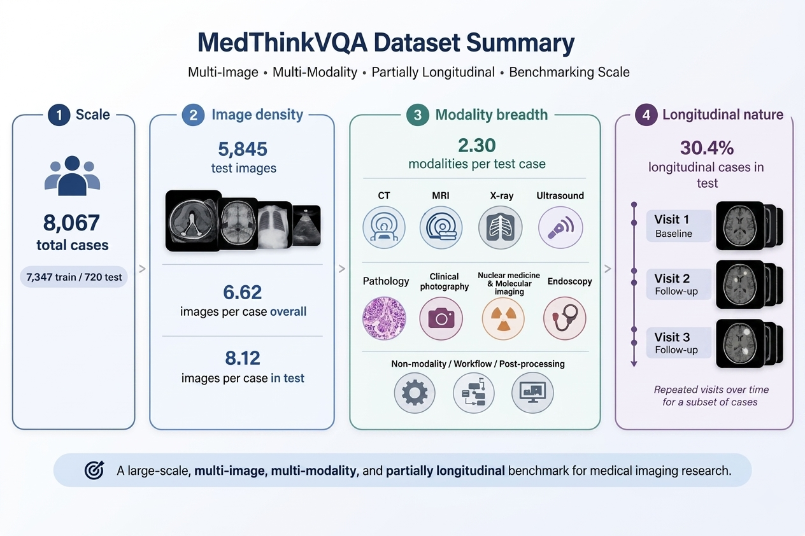

# MedThinkVQA — Medical Thinking with Multiple Images (ICLR 2026)

MedThinkVQA is an expert-annotated benchmark for **multi-image** diagnostic reasoning in radiology.  
Unlike prior medical VQA benchmarks that typically contain ≤1 image per case, MedThinkVQA requires models to **extract evidence from each image**, **integrate cross-view information**, and **perform differential-diagnosis reasoning**.

**Links**
- Hugging Face Dataset: https://huggingface.co/datasets/bio-nlp-umass/MedThinkVQA
- Leaderboard: https://benluwang.github.io/MedThinkVQA/
- Submission Guide: https://benluwang.github.io/MedThinkVQA/submit.html

## ICLR Presentation

<p align="center">
  <video src="https://github.com/benluwang/MedThinkVQA/raw/main/assets/iclr_presentation.mp4" controls width="100%"></video>
</p>

Direct video link: [assets/iclr_presentation.mp4](assets/iclr_presentation.mp4)

## Benchmark at a Glance

MedThinkVQA is designed to be hard for current multimodal models. Benchmark results show three consistent patterns: performance improves when models can use more images, when they are allowed stronger reasoning effort, and when larger multimodal variants are used within the same family.

<p align="center">
  
</p>

*Benchmark observations. Top: current open and closed models still have substantial headroom on the test benchmark. Bottom left: using more images materially improves diagnostic reasoning. Bottom middle: stronger reasoning effort also improves performance. Bottom right: larger multimodal model variants in the same family tend to perform better on MedThinkVQA.*

---

## What is MedThinkVQA?

MedThinkVQA is built around a **Think-with-Images (TwI)** workflow with explicit intermediate supervision:

1. **Step 1 — Per-Image Findings**  
   Generate concise radiological findings for *each image* in a case.

2. **Step 2 — Integrated Imaging Summary**  
   Synthesize cross-view evidence into a single case-level imaging summary.

3. **Step 3 — Differential Diagnosis (DDx) Reasoning**  
   Align the integrated summary with **five candidate diagnoses**, rule out distractors with image-grounded arguments, and select the best diagnosis.

Additionally, MedThinkVQA includes a **Medical Education Case Discussion** task where models generate teaching-style explanations grounded in the case.

<p align="center">
  
</p>

*Overview of MedThinkVQA and the Think-with-Images (TwI) workflow. Left: each case combines a clinical scenario, multiple medical images, and five candidate diagnoses. Middle: the benchmark supervises three reasoning stages, from per-image findings, to case-level integrated findings, to final differential-diagnosis reasoning. Right: evaluation goes beyond final answer accuracy, using ROUGE/RadCliQ for Steps 1-2 and structured human/LLM judging for Step 3 and educational case discussion.*

---

## Dataset

MedThinkVQA is a multi-image, multi-modality, and partially longitudinal benchmark.

<p align="center">
  
</p>

*Dataset summary covering scale, image density, modality breadth, and longitudinal structure.*

| Group | Metric | Value |
| --- | --- | --- |
| Release | Release date | 2026-04-05 |
| Scale | Total cases | 8,067 |
| Scale | Splits | 7,347 train / 720 test |
| Images | Test images | 5,845 |
| Images | Avg. images per case | 6.62 overall / 8.12 test |
| Modalities | Avg. modalities per test case | 2.30 |
| Modalities | Level-1 modalities | CT, MRI, X-ray, Ultrasound, Pathology, Clinical photography,<br>Nuclear medicine & Molecular imaging, Endoscopy,<br>Non-modality / Workflow / Post-processing |
| Longitudinal | Longitudinal cases in test | 30.4% |
| Filtering | Images are necessary | text-solvable and leakage cases are filtered |

---

## Data License & Responsible Use (IMPORTANT)

**Data source:** Eurorad (European Society of Radiology), adapted with permission.  
**Dataset license:** **CC BY-NC-SA 4.0**.  
**Allowed use:** research and education only.  
**Prohibited:** commercial use; use as a clinical device; diagnosis/treatment/triage.

**Privacy note:** Cases are intended for education and are de-identified to the best of our knowledge. If you believe any content contains residual identifiers, please contact us immediately:  
- zonghaiyao@umass.edu  
- benlu.wang@yale.edu

---

## Download

### Hugging Face
```python
from datasets import load_dataset

ds = load_dataset("bio-nlp-umass/MedThinkVQA", split="test")
sample = ds[0]
print(sample["CLINICAL_HISTORY"])
print(sample["options"])
print(sample["correct_answer"])
print(sample["image_01_path"])
print(sample["image_01_caption"])
```

- https://huggingface.co/datasets/bio-nlp-umass/MedThinkVQA
---

## Data Format

Each row is a multiple-choice diagnostic reasoning example with:

- `title`
- `CLINICAL_HISTORY`
- `IMAGING_FINDINGS`
- `discussion`
- `options`
- `correct_answer`
- `correct_answer_text`
- `ICD Chapter`
- `ICD Block`
- `ICD Category`
- `is_longitudinal`
- `timepoint_count`
- `interval_text`
- `image_count`
- `image_01_id` ... `image_49_id`
- `image_01_path` ... `image_49_path`
- `image_01_caption` ... `image_49_caption`
- `image_01_modality` ... `image_49_modality`
- `image_01_sub_modality` ... `image_49_sub_modality`

Notes:

- `train.parquet`, `test.parquet`, `train.jsonl`, and `test.jsonl`
- In the Parquet viewer, image slots may additionally appear as embedded `image_01` ... `image_49` image features.
- Image files live under `images/caseXXXXX/<img_id>.jpg`.

Example row excerpt from `test.jsonl`:
```json
{
  "title": "Case number 19254",
  "CLINICAL_HISTORY": "A 39-year-old aluminium worker presented with a year-long history of diffuse hand pain, swelling, and bilateral finger desquamation, partially responsive to prednisolone. The exam revealed mechanic’s hands, Gottron’s papules, elbow and knee desquamation, high creatine kinase/myoglobin, but preserved muscle strength and no joint inflammation.",
  "IMAGING_FINDINGS": "Magnetic resonance imaging of the pelvis and thighs demonstrated diffuse interstitial oedema within the pelvic and thigh muscle groups, without significant associated atrophy or fatty infiltration, findings suggestive of non-specific myositis. There was also associated intermuscular fascial oedema. Computed tomography of the chest revealed areas of ground-glass opacification in both lower lobes, the middle lobe, and the lingula, suggestive of involvement by interstitial lung disease.",
  "options": {
    "A": "Rheumatoid arthritis",
    "B": "Anti-synthetase syndrome",
    "C": "Mixed connective tissue disease",
    "D": "Systemic sclerosis",
    "E": "Dermatomyositis / Polymyositis"
  },
  "correct_answer": "B",
  "correct_answer_text": "Anti-synthetase syndrome",
  "ICD Chapter": "Chapter XIII - Diseases of the musculoskeletal system and connective tissue",
  "ICD Block": "M30-M36 - Systemic connective tissue disorders",
  "ICD Category": "M33 - Dermatopolymyositis",
  "is_longitudinal": false,
  "timepoint_count": 1,
  "interval_text": "",
  "image_count": 4,
  "image_01_id": "6D-JPs9h",
  "image_01_path": "images/case19254/6D-JPs9h.jpg",
  "image_01_caption": "Coronal short-TI inversion recovery (STIR) image of the pelvis and thighs demonstrates diffuse interstitial oedema within the pelvic and thigh muscle groups, without significant associated atrophy or fatty infiltration, suggestive of myositis.",
  "image_01_modality": "MRI",
  "image_01_sub_modality": "Conventional MRI",
  "image_02_id": "EKdcRGiN",
  "image_02_path": "images/case19254/EKdcRGiN.jpg",
  "image_02_caption": "Axial T2-weighted image of the thighs demonstrates more pronounced interstitial oedema in the vastus lateralis, intermedius, and medialis muscles, as well as the adductor magnus muscles, with milder oedema in the hamstring and rectus femoris muscle groups.",
  "image_02_modality": "MRI",
  "image_02_sub_modality": "Conventional MRI",
  "image_03_id": "PDr3f_j4",
  "image_03_path": "images/case19254/PDr3f_j4.jpg",
  "image_03_caption": "Axial T2-weighted image of the distal thighs shows intermuscular fascial oedema, more pronounced in the fascial planes adjacent to the distal portions of the semitendinosus and semimembranosus muscles.",
  "image_03_modality": "MRI",
  "image_03_sub_modality": "Conventional MRI",
  "image_04_id": "hPl6lXhy",
  "image_04_path": "images/case19254/hPl6lXhy.jpg",
  "image_04_caption": "Axial chest CT image demonstrates areas of ground-glass opacification in both lower lobes, the middle lobe, and the lingula, findings that are nonspecific but suggest involvement by interstitial lung disease in a patient with known myositis.",
  "image_04_modality": "CT",
  "image_04_sub_modality": "HRCT / Thin-slice CT"
}
```

---

## Code

- `model/`: inference backends and API wrappers used by the project
- `data_processing/`: selected non-training, non-evaluation preprocessing utilities

---

## Contact

- zonghaiyao@umass.edu
- benlu.wang@yale.edu
